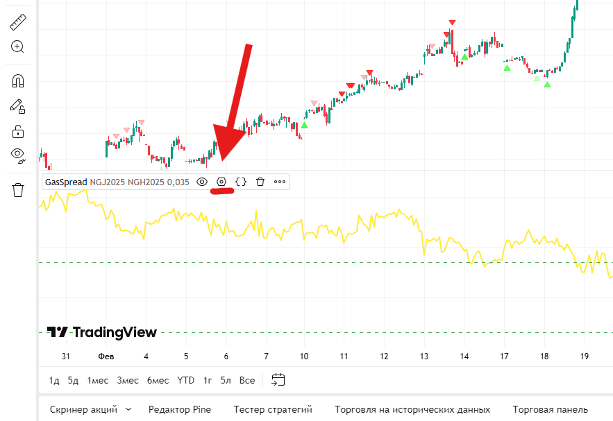
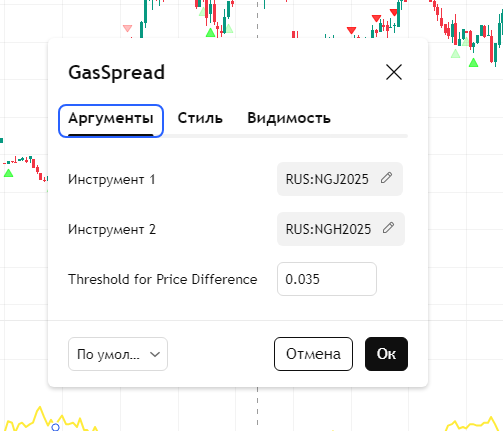
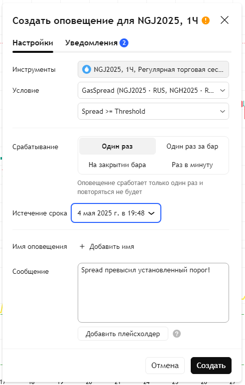

# Gas Futures Spread Indicator

Этот скрипт на PineScript (v5) рассчитывает спред между двумя фьючерсными контрактами на газ и отображает его в виде отдельного графика. Скрипт также позволяет задать пороговые значения (верхний и нижний), при достижении которых можно автоматически получать уведомления (alerts).

---

## Описание

- **Instrument 1 / Instrument 2**  
  Выберите тикеры нужных фьючерсов на газ. По умолчанию установлены: `RUS:NGJ2025` и `RUS:NGH2025`.


- **Threshold**  
  Значение порога, которое задается как абсолютное число.

При достижении спредом заданного порога (сверху или снизу) срабатывают алерты, если они настроены в TradingView.

---

## Установка скрипта в TradingView

1. **Откройте TradingView**  
   Перейдите на сайт [TradingView](https://www.tradingview.com) и войдите в свой аккаунт.

2. **Перейдите на вкладку "Chart" (График)**  

3. **Откройте Pine Editor**  
   В нижней или боковой панели найдите и откройте вкладку **Pine Editor**.  
   

4. **Скопируйте и вставьте код**  
   Скопируйте приведённый ниже код и вставьте его в редактор Pine Script предварительно удалив текст который был там:

```pine
// Версия скрипта
//@version=5
indicator(title="Gas Futures Spread", shorttitle="GasSpread", overlay=false)

// Вводимые параметры
instrument1 = input.symbol("RUS:NGJ2025", "Instrument 1")
instrument2 = input.symbol("RUS:NGH2025", "Instrument 2")
threshold   = input.float(0.035, "Threshold for Price Difference")

// Получаем цены закрытия с указанных тикеров на текущем таймфрейме
price1 = request.security(instrument1, timeframe.period, close)
price2 = request.security(instrument2, timeframe.period, close)

// Считаем спред
spread = price1 - price2

// Рисуем спред на графике
plot(spread, color=color.yellow, linewidth=2, title="Spread")

// Для наглядности — горизонтальные линии на уровне порога и -порога
hline(threshold,  color=color.new(color.green, 0), linewidth=1, title="Upper Threshold")
hline(-threshold, color=color.new(color.green, 0), linewidth=1, title="Lower Threshold")

// Условия для алертов
    alertcondition(spread >= threshold,  title="Spread >= Threshold",   message="Spread превысил установленный порог!")
    alertcondition(spread <= -threshold, title="Spread <= -Threshold",  message="Spread опустился ниже -установленного порога!")
```
5. **Сохраните и добавьте индикатор на график**  
   Нажмите **Добавить на график** , затем **Опубликовать индикатор**, на открывшейся старнице выберите **Опубликовать новый скрипт**, напишите любое описание и нажмите **Продолжить** , затем выбирите **Приватный скрипт**, видимость **Открыт** и нажмите кнопку **Опубликовать приватный скрипт**
   
6. **Настройте параметры индикатора**  
   Теперь вернемся на график, закрываем Pine редактор нажатием на _ и перейдем в настройки индикатора.
   
   В настройках (иконка шестерёнки) можно изменить тикеры, режим расчета спреда и пороговое значение.  
   

---

## Настройка уведомлений (Alerts)

Чтобы получать уведомления при достижении спредом заданных пороговых значений, выполните следующие шаги:

1. **Откройте окно Alerts**  
   После добавления индикатора на график нажмите кнопку **Alerts** на верхней панели или используйте сочетание клавиш `Alt + A`.  
   

2. **Создайте новый алерт**  
   Нажмите **Create Alert** (Создать алерт).

3. **Настройте условие алерта**  
   В поле **Condition** выберите:
   - Ваш индикатор `Gas Futures Spread (Abs or %)`
   - Одно из условий:
     - `Spread >= Threshold` — срабатывает, когда спред превышает верхний порог.
     - `Spread <= -Threshold` — срабатывает, когда спред опускается ниже нижнего порога.

4. **Настройте параметры уведомления**  
   Укажите:
   - Тип уведомления (звук, всплывающее окно, e-mail и т.д.)
   - Частоту срабатывания алерта (одноразово или при каждом изменении условия).
   - Текст уведомления (можно оставить предложенный по умолчанию или изменить по своему усмотрению).
   - **Поставьте максимальную дату истечение срока если у вас бесплатная версия tradingview** или поставьте галочку бессрочное оповещение.
5. **Сохраните алерт**  
   Нажмите **Create**, чтобы активировать уведомление.

---

## Лицензия

Этот скрипт распространяется «как есть». Автор не несёт ответственности за возможные финансовые потери. Используйте на свой страх и риск.

---

Если у вас возникли вопросы или предложения, пожалуйста, создайте issue или pull request в данном репозитории, или напишите в телеграм @stepan163s
