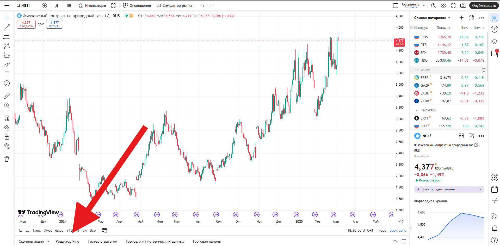

# Gas Futures Spread Indicator

Этот скрипт на PineScript (v5) рассчитывает спред между двумя фьючерсными контрактами на газ и отображает его в виде отдельного графика. Скрипт также позволяет задать пороговые значения (верхний и нижний), при достижении которых можно автоматически получать уведомления (alerts).

В репозитории используются следующие изображения (их нужно разместить в папке `img`):
- **main_screen.png** – скриншот главного экрана TradingView с добавленным индикатором.
- **pine_editor.png** – скриншот окна Pine Editor с кодом индикатора.
- **indicator_setup.png** – скриншот настроек индикатора.
- **alerts_setup.png** – скриншот окна настройки уведомлений (Alerts).

---

## Описание

- **Instrument 1 / Instrument 2**  
  Выберите тикеры нужных фьючерсов на газ. По умолчанию установлены: `RUS:NGJ2025` и `RUS:NGH2025`.

- **Use Percentage Spread Calculation?**  
  Опция для переключения между расчетом спреда в абсолютном значении и в процентах.

- **Threshold**  
  Значение порога, которое задается как абсолютное число или процент (в зависимости от выбранного режима).

При достижении спредом заданного порога (сверху или снизу) срабатывают алерты, если они настроены в TradingView.

---

## Установка скрипта в TradingView

1. **Откройте TradingView**  
   Перейдите на сайт [TradingView](https://www.tradingview.com) и войдите в свой аккаунт.

2. **Перейдите на вкладку "Chart" (График)**  
   

3. **Откройте Pine Editor**  
   В нижней или боковой панели найдите и откройте вкладку **Pine Editor**.  
   

4. **Скопируйте и вставьте код**  
   Скопируйте приведённый ниже код и вставьте его в редактор Pine Script:

   ```pine
   //@version=5
   indicator(title="Gas Futures Spread (Abs or %)", shorttitle="GasSpread", overlay=false)
   
   // --- Вводимые параметры
   instrument1  = input.symbol("RUS:NGJ2025", "Instrument 1")
   instrument2  = input.symbol("RUS:NGH2025", "Instrument 2")
   usePercent   = input.bool(false, "Use Percentage Spread Calculation?")
   thresholdVal = input.float(0.035, "Threshold")
   
   // --- Получаем цены с выбранных тикеров
   price1 = request.security(instrument1, timeframe.period, close)
   price2 = request.security(instrument2, timeframe.period, close)
   
   // --- Считаем спред
   spread = usePercent 
       ? (price1 - price2) / price2 * 100 
       : (price1 - price2)
   
   // --- Рисуем сам спред
   plot(spread, color=color.yellow, linewidth=2, title="Spread")
   
   // --- Рисуем две горизонтальные линии: +thresholdVal и -thresholdVal
   hline(+thresholdVal, title="Upper Threshold", color=color.green, linewidth=1)
   hline(-thresholdVal, title="Lower Threshold", color=color.green, linewidth=1)
   
   // --- Настраиваем алерты
   alertcondition(
       spread >= thresholdVal, 
       title="Spread >= Threshold", 
       message="Spread превысил установленный порог!"
   )
   
   alertcondition(
       spread <= -thresholdVal, 
       title="Spread <= -Threshold", 
       message="Spread опустился ниже -установленного порога!"
   )
   ```

5. **Сохраните и добавьте индикатор на график**  
   Нажмите **Save** (Сохранить), затем **Add to Chart** (Добавить на график).

6. **Настройте параметры индикатора**  
   В настройках (иконка шестерёнки) можно изменить тикеры, режим расчета спреда и пороговое значение.  
   

---

## Настройка уведомлений (Alerts)

Чтобы получать уведомления при достижении спредом заданных пороговых значений, выполните следующие шаги:

1. **Откройте окно Alerts**  
   После добавления индикатора на график нажмите кнопку **Alerts** на верхней панели или используйте сочетание клавиш `Alt + A`.  
   

2. **Создайте новый алерт**  
   Нажмите **Create Alert** (Создать алерт).

3. **Настройте условие алерта**  
   В поле **Condition** выберите:
   - Ваш индикатор `Gas Futures Spread (Abs or %)`
   - Одно из условий:
     - `Spread >= Threshold` — срабатывает, когда спред превышает верхний порог.
     - `Spread <= -Threshold` — срабатывает, когда спред опускается ниже нижнего порога.

4. **Настройте параметры уведомления**  
   Укажите:
   - Тип уведомления (звук, всплывающее окно, e-mail и т.д.)
   - Частоту срабатывания алерта (одноразово или при каждом изменении условия).
   - Текст уведомления (можно оставить предложенный по умолчанию или изменить по своему усмотрению).

5. **Сохраните алерт**  
   Нажмите **Create**, чтобы активировать уведомление.

---

## Лицензия

Этот скрипт распространяется «как есть». Автор не несёт ответственности за возможные финансовые потери. Используйте на свой страх и риск.

---

Если у вас возникли вопросы или предложения, пожалуйста, создайте issue или pull request в данном репозитории, или напишите в телеграм @stepan163s
